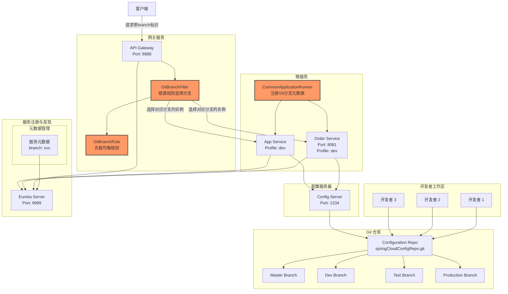

# springCloud

#### 介绍
个人springCloud 测试项目 

#### 主要实现功能：  
基础git branch 的分支管理，实现多版本一套环境共同开发

## 架构图




## 多分支全链路追踪机制 (核心功能)

这是本项目的核心创新点，通过以下组件实现：

### 服务分支元数据注册 (`CommonApplicationRunner.java`)

```java
@Component
public class CommonApplicationRunner implements ApplicationRunner {
    @Autowired
    ApplicationInfoManager manager;
    
    @Autowired
    private GitProperties gitProperties;
    
    @Override
    public void run(ApplicationArguments args) throws Exception {
        Map<String, String> branch = new HashMap<>();
        branch.put("branch", gitProperties.getBranch());
        manager.registerAppMetadata(branch);
    }
}
```

- 每个微服务启动时，通过 `CommonApplicationRunner` 获取当前 Git 分支信息
- 将分支信息作为元数据注册到 Eureka 服务注册中心
- 这样每个服务实例在 Eureka 中都会带有所属的 Git 分支标识

### 网关层分支路由过滤器 (`GitBranchFilter.java`)

```java
@Component
public class GitBranchFilter extends LoadBalancerClientFilter {
    @Autowired
    DiscoveryClient client;

    @Override
    protected ServiceInstance choose(ServerWebExchange exchange) {
        ServerHttpRequest request = exchange.getRequest();
        // 可以从 HTTP 请求头中获取分支信息
        // 也可以基于用户 IP 地址动态映射到特定分支
        
        String ipAddress = IPUtil.getIpAddress(request);
        String branch = "master"; // 默认分支，可根据规则动态确定
        
        URI uri = exchange.getAttribute(GATEWAY_REQUEST_URL_ATTR);
        String host = uri.getHost();
        List<ServiceInstance> instances = client.getInstances(host);
        
        // 筛选出指定分支的服务实例
        List<ServiceInstance> branchList = instances.stream()
            .filter(a -> a.getMetadata().get("branch")
            .equalsIgnoreCase(branch))
            .collect(Collectors.toList());
            
        if (CollectionUtils.isEmpty(branchList)) {
            //默认 master 分支
            branchList = instances.stream()
                .filter(a -> a.getMetadata().get("branch")
                .equalsIgnoreCase("master"))
                .collect(Collectors.toList());
        }
        
        // 将分支信息传递给下游服务
        exchange.mutate().request(request.mutate().header("branch", branch).build()).build();
        return branchList.get(0);
    }
}
```

- 网关接收到请求后，通过 `GitBranchFilter` 获取请求中的分支信息
- 根据分支信息从服务注册中心筛选出对应分支的服务实例
- 将分支信息添加到请求头中，传递给下游服务，实现全链路分支追踪

### 负载均衡规则 (`GitBranchRule.java`)

```java
public class GitBranchRule extends ZoneAvoidanceRule {
    @Override
    public Server choose(Object key) {
        ILoadBalancer lb = this.getLoadBalancer();
        List<Server> allServers = filterServers(lb.getAllServers());
        Optional<Server> server = this.getPredicate().chooseRoundRobinAfterFiltering(allServers, key);
        return server.isPresent() ? (Server) server.get() : null;
    }

    private List<Server> filterServers(List<Server> serverList) {
        String branch = "master"; // 可从上下文获取
        
        if (StringUtils.isNotBlank(branch)) {
            List<Server> list = new ArrayList<>();
            for (Server server : serverList) {
                if (((DiscoveryEnabledServer) server).getInstanceInfo()
                    .getMetadata().get("branch").equalsIgnoreCase(branch)) {
                    list.add(server);
                }
            }
            return list;
        } else {
            return serverList; // 默认返回所有服务
        }
    }
}
```

- 自定义负载均衡规则，确保请求只路由到相同分支的服务实例
- 从所有可用服务中筛选出对应分支的服务进行负载均衡

#### 参考： 
https://mp.weixin.qq.com/s/AViqUPlTyxcb8okDiDXHrQ

https://jishuin.proginn.com/p/763bfbd60aad


