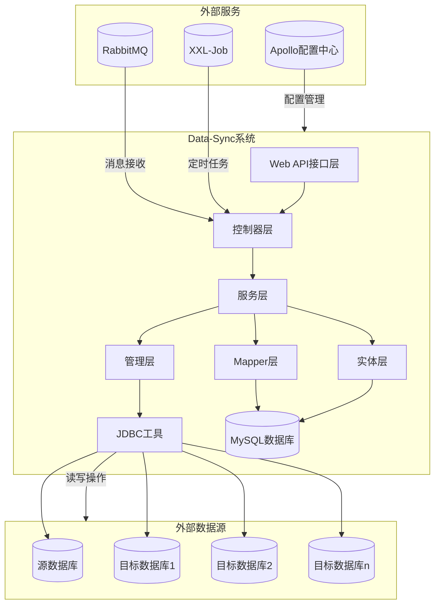
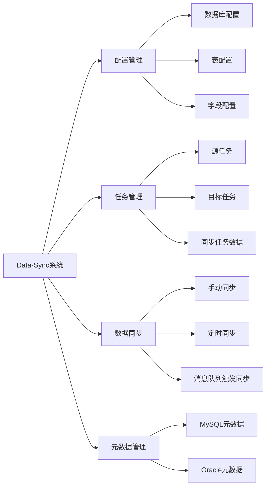
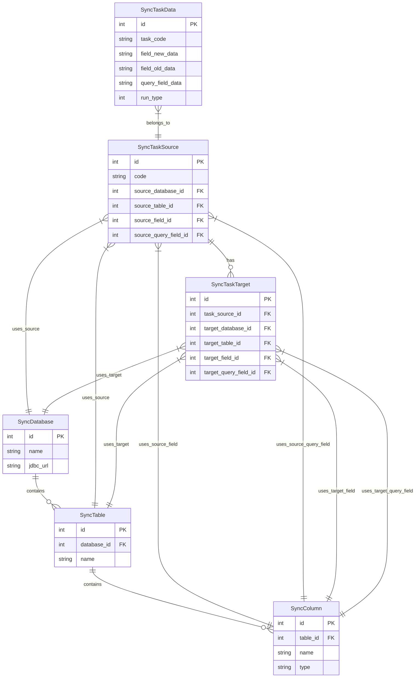
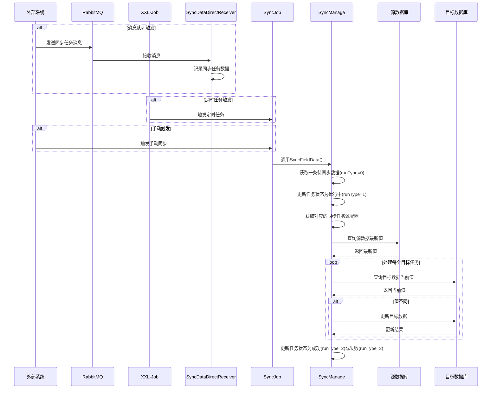
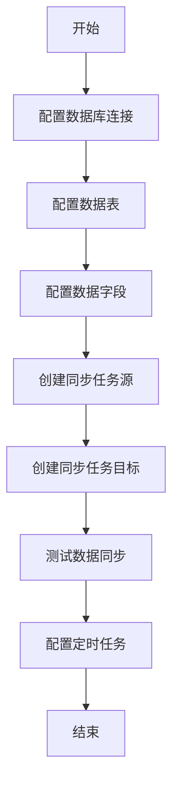
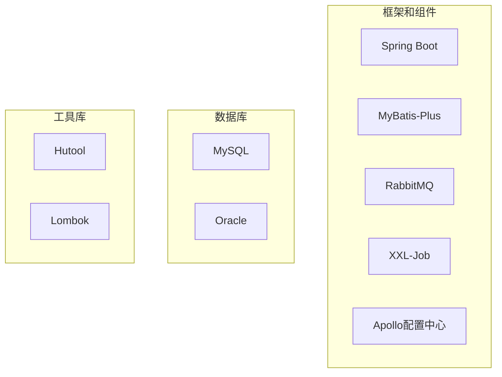
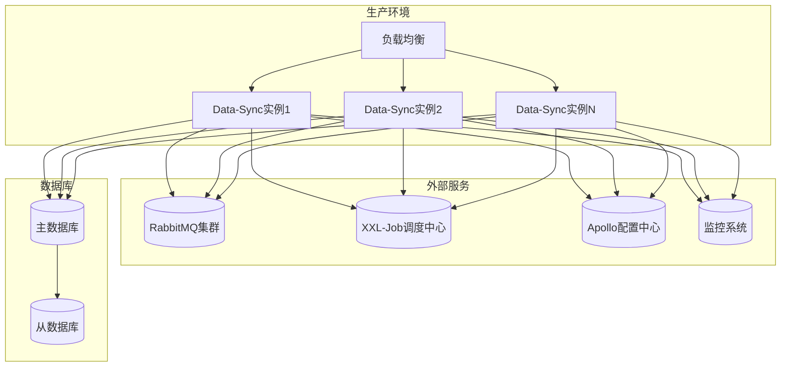

# Data-Sync 系统文档

## 项目简介

Data-Sync 是一个冗余字段同步系统，主要用于在多个数据库之间同步特定数据字段的值，确保数据一致性。系统通过定义源数据库和目标数据库，以及相应的表和字段，实现自动化的数据同步操作。

## 系统架构图

## 核心组件

## 数据模型

## 系统流程图

### 数据同步流程

### 任务配置流程

## 技术栈

## 部署架构

## 总结

Data-Sync系统是一个用于解决数据冗余同步问题的专用系统，通过配置源数据库和目标数据库之间的映射关系，实现了数据字段的自动化同步。系统支持通过消息队列、定时任务和手动触发三种方式进行数据同步，满足了不同场景下的需求。

数据同步过程的核心是：
1. 从源数据库读取最新值
2. 与目标数据库中的当前值进行比较
3. 如果值不同，则更新目标数据库中的对应字段

系统的设计遵循了分层架构，使用SpringBoot作为基础框架，MyBatis-Plus作为ORM框架，RabbitMQ作为消息队列，XXL-Job作为定时任务调度框架，Apollo作为配置中心。系统支持MySQL和Oracle等不同类型的数据库，通过工厂模式和策略模式实现了对不同数据库的统一操作。 