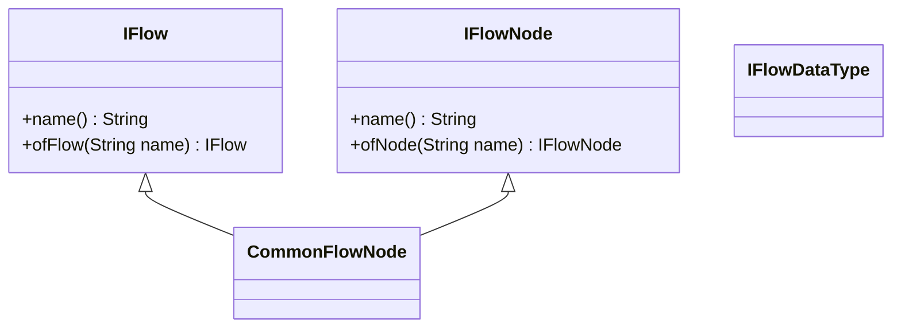
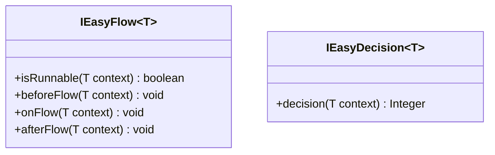
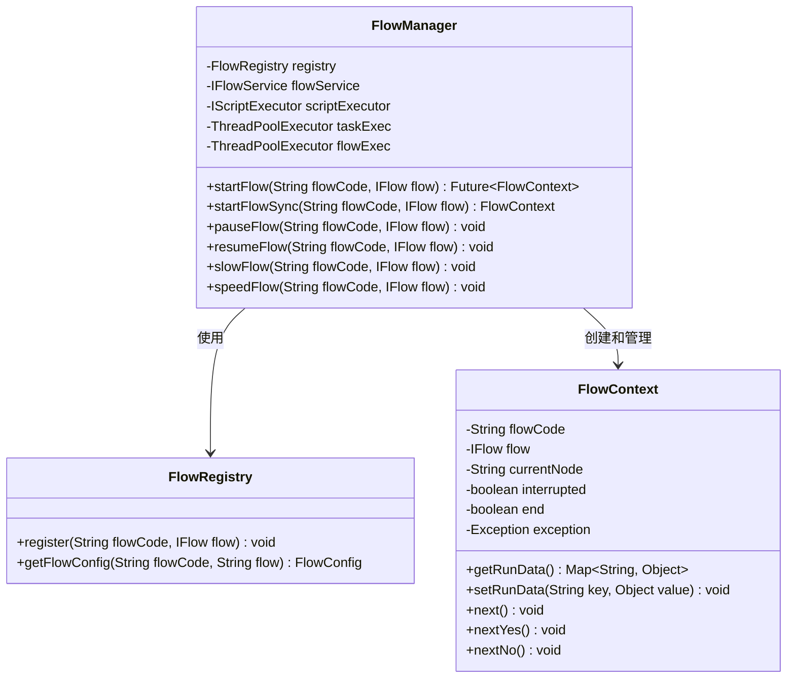
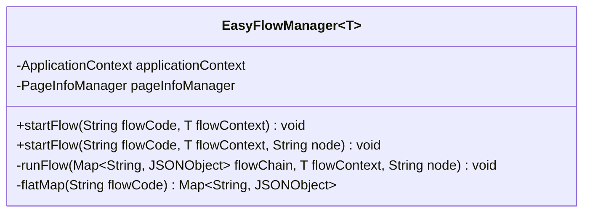
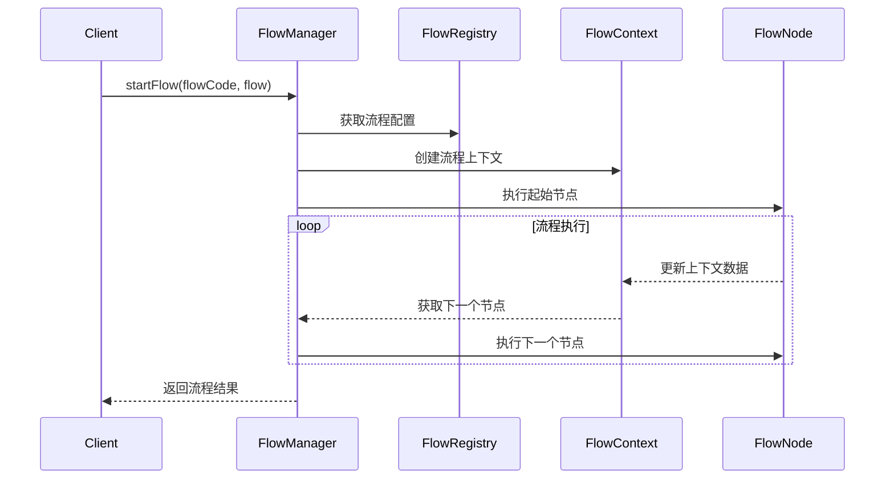
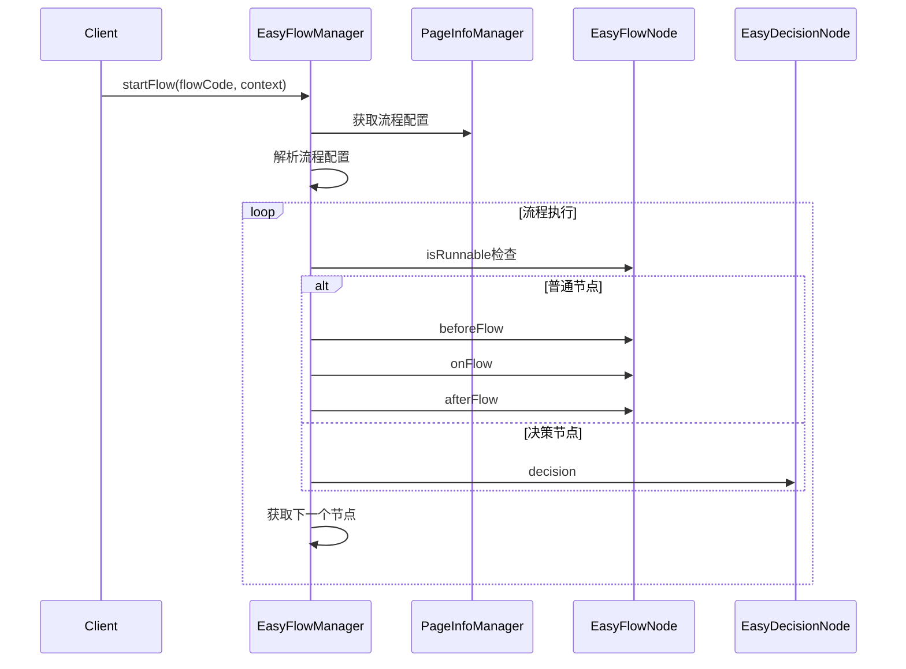
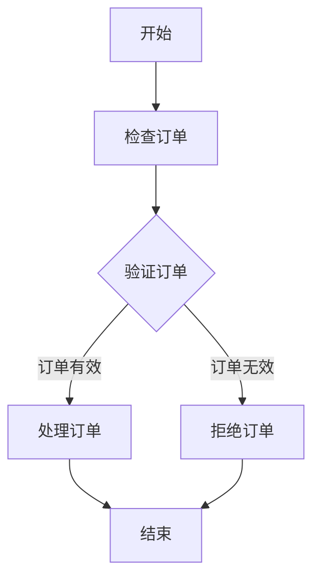
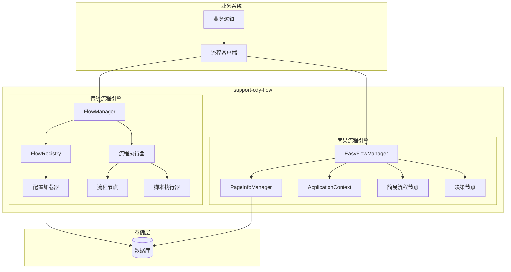

# low 工作流引擎文档

## 1. 概述

`support-ody-flow` 是一个基于 Java 的轻量级工作流引擎，主要用于定义和执行业务流程。该引擎提供了两种工作流实现方式：

1. **传统流程引擎**：通过 `FlowManager` 管理的复杂工作流，支持节点间的跳转、条件判断和并发执行。
2. **简易流程引擎**：通过 `EasyFlowManager` 管理的简化版工作流，适用于较为简单的线性业务流程。

该工作流引擎具有高度的可配置性和灵活性，能够帮助开发者将复杂的业务逻辑拆解为可管理的节点，实现业务流程的标准化和可视化。

## 2. 核心组件

### 2.1 核心接口

#### 传统流程引擎



- **IFlow**：工作流定义接口，定义一个流程的基本属性
- **IFlowNode**：工作流节点接口，定义流程中的节点
- **IFlowDataType**：流程数据类型接口，用于定义流程中传输的数据类型

#### 简易流程引擎



- **IEasyFlow**：简易流程节点接口，处理单个节点的业务逻辑
- **IEasyDecision**：决策节点接口，用于条件判断和流程分支

### 2.2 核心管理类

#### 传统流程引擎



#### 简易流程引擎



## 3. 工作流程原理

### 3.1 传统流程引擎



传统流程引擎的工作流程如下：

1. **流程定义**：通过配置文件或数据库定义流程的节点和流转条件。
2. **流程启动**：调用 `FlowManager.startFlow()` 方法启动流程。
3. **节点执行**：系统按照预定义的流程路径，执行每个节点的业务逻辑。
4. **决策分支**：基于条件判断，决定下一个执行的节点。
5. **流程结束**：到达结束节点或流程被中断时，流程结束。

工作流引擎支持以下特性：
- **异步执行**：流程可以异步执行，不阻塞调用线程
- **事务支持**：可以在流程中使用事务
- **并发流程**：支持并发执行多个流程节点
- **流程监控**：提供流程执行状态监控
- **流程可视化**：生成流程图展示流程定义

### 3.2 简易流程引擎



简易流程引擎的工作流程更为简化：

1. **流程配置**：通过JSON数组格式化的配置文件定义流程
2. **流程启动**：调用 `EasyFlowManager.startFlow()` 方法启动流程
3. **节点执行**：系统顺序执行每个节点，节点类型包括：
   - **开始节点**：标记流程开始
   - **普通节点**：执行业务逻辑
   - **决策节点**：根据条件判断下一步流程
   - **结束节点**：标记流程结束

## 4. 配置说明

### 4.1 传统流程引擎配置

传统流程引擎需要配置以下内容：

- **流程定义**：包含流程名称、流程代码、流程描述等基本信息
- **节点定义**：包含节点名称、节点代码、节点描述等信息
- **流转规则**：定义节点间的流转条件和路径

### 4.2 简易流程引擎配置

简易流程引擎采用JSON格式配置，示例如下：

```json
[
  {
    "node": "start",
    "next_node": "checkOrderNode"
  },
  {
    "node": "checkOrderNode",
    "note": "检查订单",
    "next_node": "validateOrderNode"
  },
  {
    "node": "validateOrderNode",
    "note": "验证订单",
    "type": "decision",
    "next_node": "processOrderNode",
    "next_node2": "rejectOrderNode",
    "cond": "订单有效",
    "cond2": "订单无效"
  },
  {
    "node": "processOrderNode",
    "note": "处理订单",
    "next_node": "end"
  },
  {
    "node": "rejectOrderNode",
    "note": "拒绝订单",
    "next_node": "end"
  },
  {
    "node": "end"
  }
]
```

## 5. 使用示例

### 5.1 传统流程引擎

```java
// 启动同步流程
FlowContext ctx = flowManager.startFlowSync("ORDER_PROCESS", flowManager.ofFlow("orderFlow"));

// 启动异步流程
Future<FlowContext> future = flowManager.startFlow("ORDER_PROCESS", flowManager.ofFlow("orderFlow"));
FlowContext ctx = future.get();

// 设置流程数据
Map<String, Object> data = new HashMap<>();
data.put("orderId", "12345");
data.put("userId", "user001");
Future<FlowContext> future = flowManager.startFlowWithData(
    "ORDER_PROCESS", 
    flowManager.ofFlow("orderFlow"), 
    data, 
    true
);
```

### 5.2 简易流程引擎

```java
// 定义流程上下文
OrderContext orderContext = new OrderContext();
orderContext.setOrderId("12345");
orderContext.setUserId("user001");

// 启动流程
easyFlowManager.startFlow("ORDER_PROCESS_CONFIG", orderContext);
```

## 6. 流程可视化

`support-ody-flow` 提供了流程可视化功能，可以生成流程图展示流程定义，帮助开发者和业务人员更直观地理解流程。

### 6.1 流程图示例



## 7. 最佳实践

1. **流程拆分**：将复杂业务流程拆分为独立的小流程，每个流程专注于解决特定问题
2. **节点复用**：设计通用节点，在不同流程中复用
3. **数据隔离**：清晰定义节点输入和输出，确保数据在节点间正确传递
4. **异常处理**：为流程设计合理的异常处理机制，确保流程可靠执行
5. **监控与日志**：配置流程监控和日志记录，方便排查问题

## 8. 架构图



## 9. 总结

`support-ody-flow` 工作流引擎提供了一种灵活、可扩展的方式来定义和执行业务流程。通过将复杂业务拆分为一系列节点和流转规则，可以更好地管理业务逻辑，提高代码的可维护性和可扩展性。

该工作流引擎适用于以下场景：

1. **复杂业务流程**：如订单处理、审批流程、任务调度等
2. **状态机管理**：需要管理对象在不同状态间转换的场景
3. **可视化业务流程**：需要将业务流程可视化展示给业务人员
4. **动态流程调整**：需要在不修改代码的情况下调整业务流程

通过正确使用 `support-ody-flow`，开发者可以更专注于业务逻辑的实现，而将流程控制的责任交给工作流引擎，从而提高开发效率和代码质量。 