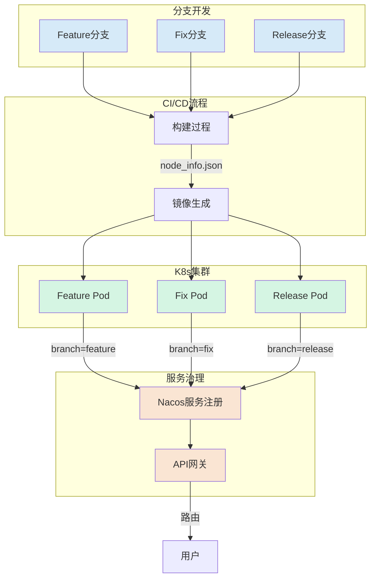
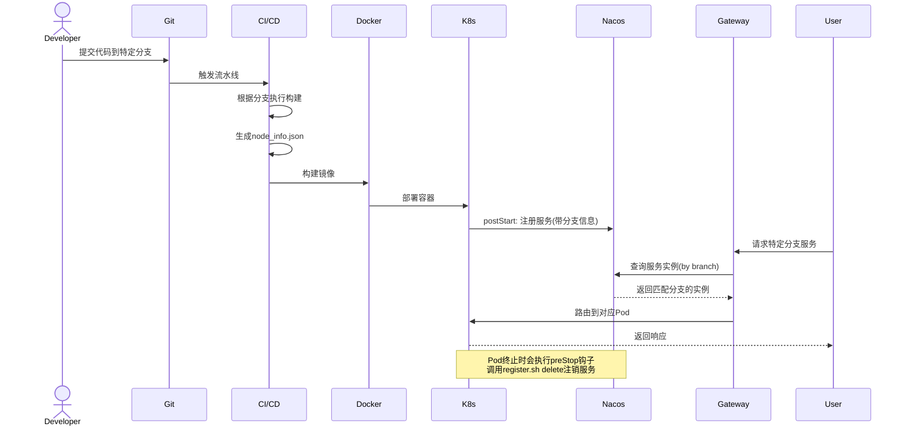
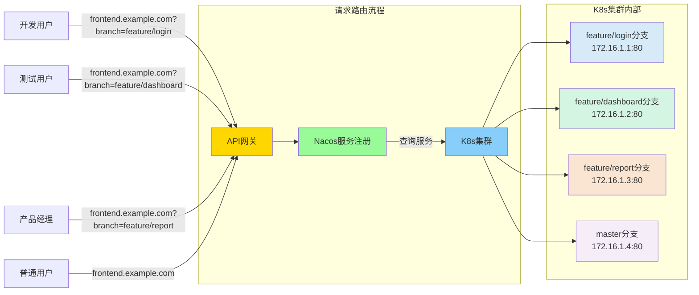

# 前端分支隔离实践

## 概述

前端分支隔离是一种部署策略，允许不同分支的前端代码同时部署在同一环境中，互不干扰。这种策略对于并行开发、功能测试和持续集成十分有价值，确保开发团队可以独立工作而不会相互阻塞。

## 架构图



## 实现原理

我们的前端分支隔离方案主要通过以下几个方面实现：

1. **构建差异化**：针对不同分支执行不同的构建命令
2. **容器化部署**：使用Docker将前端应用容器化
3. **服务注册与发现**：利用Nacos进行服务注册，包含分支信息
4. **Kubernetes编排**：利用K8s进行容器生命周期管理

## 核心组件

### 部署脚本 (deploy.sh)

部署脚本负责处理依赖安装和构建过程，并根据分支名称执行不同的构建命令：

```
  sed -e "s/COMMIT_ID/${CI_COMMIT_SHA}/g" -e "s/COMMIT_TIME/$(date -u +"%Y-%m-%dT%H:%M:%SZ")/g" -e "s/BRANCH/${CI_COMMIT_REF_NAME}/g"  -e "s/SHORT_ID/$(git rev-parse --short HEAD)/g" dev/node_info.template > node_info.json
```

该脚本为每个分支创建唯一的构建信息，包括提交ID、时间戳和分支名称。

### Dockerfile

Dockerfile定义了构建和运行前端应用的容器环境：

```
FROM registry-itwork.yonghui.cn/public/basefront:v1.3.0
WORKDIR /root
ADD dist/ /usr/share/nginx/html
ARG gitbranch
ENV BRANCH=${gitbranch}
COPY node_info.json /root/node_info.json
COPY dev/register.sh /root/register.sh
```

每个容器镜像携带分支信息，并包含服务注册脚本。

### 服务注册脚本 (register.sh)

服务注册脚本负责向Nacos注册/注销服务实例，并在元数据中包含分支信息：

```
METADATA=$(cat <<EOF
{"preserved.register.source":"shell","branch":"${BRANCH}"}
EOF
)
```

这使得服务发现系统能够区分不同分支的实例。

### Kubernetes生命周期管理

K8s配置确保容器在启动和停止时正确注册和注销服务：

```yaml
lifecycle:
  postStartEnabled: true
  preStopEnabled: true
  preStop:
    exec:
      command:
      - "/bin/bash"
      - "-cx"
      - "/root/register.sh delete"
  postStart:
    exec:
      command:
      - "/bin/bash"
      - "-cx"
      - "/root/register.sh register"
```

## 工作流程



## 优势

1. **并行开发**：多个功能可以同时开发且部署到同一环境
2. **隔离测试**：QA可以独立测试每个分支的功能
3. **快速迭代**：避免了部署排队，加速了开发周期
4. **风险隔离**：一个分支的问题不会影响其他分支
5. **资源优化**：共享基础设施资源，减少环境维护成本

## 最佳实践

1. **分支命名规范**：采用统一的分支命名约定，如`feature/xxx`、`bugfix/xxx`
2. **自动清理**：定期清理不活跃分支的部署，避免资源浪费
3. **环境信息**：为每个分支部署提供明确的环境标识
4. **版本追踪**：在UI中显示当前分支和提交信息，便于问题追踪
5. **权限控制**：限制谁可以部署到哪些环境

## 分支隔离的实际效果



## 总结

前端分支隔离为并行开发和测试提供了强大支持，通过容器化、服务注册和Kubernetes编排，我们实现了一套灵活且高效的前端部署策略，显著提升了团队协作效率和产品迭代速度。 