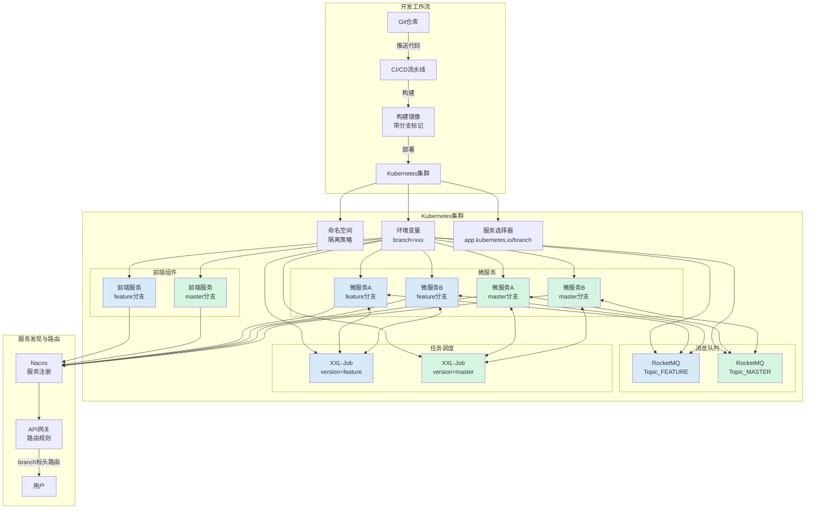

# Kubernetes多分支隔离实践指南

## 概述

在现代软件开发中，特别是采用微服务架构的团队，多分支并行开发已成为常态。这种模式允许多个功能同时开发，但也带来了如何在同一环境中隔离不同分支的挑战。本文提供了一个在Kubernetes环境中实现全面分支隔离的综合指南，涵盖从前端到后端微服务、消息队列和任务调度的各个方面。

## 分支隔离架构图



## Kubernetes分支隔离实现策略

### 1. 环境变量注入

环境变量是实现分支隔离的最简单方式，通过在Pod定义中注入分支信息：

```yaml
apiVersion: apps/v1
kind: Deployment
metadata:
  name: my-app-feature
  labels:
    app: my-app
    branch: feature
spec:
  selector:
    matchLabels:
      app: my-app
      branch: feature
  template:
    metadata:
      labels:
        app: my-app
        branch: feature
    spec:
      containers:
      - name: app
        image: my-app:feature
        env:
        - name: BRANCH
          value: "feature"
```

### 2. 命名空间隔离

可以为每个分支创建单独的命名空间，或者使用命名规则区分：

```bash
# 创建分支专用命名空间
kubectl create namespace feature-branch

# 或在同一命名空间中使用命名规则
kubectl apply -f app-feature.yaml -n development
```

### 3. 标签选择器

使用Kubernetes标签和选择器机制隔离服务：

```yaml
apiVersion: v1
kind: Service
metadata:
  name: my-app-feature
spec:
  selector:
    app: my-app
    branch: feature
  ports:
  - port: 80
    targetPort: 8080
```

### 4. ConfigMap与Secret隔离

为不同分支创建专用的配置：

```yaml
apiVersion: v1
kind: ConfigMap
metadata:
  name: app-config-feature
  labels:
    branch: feature
data:
  config.json: |
    {
      "apiUrl": "http://api-feature",
      "branchName": "feature"
    }
```

### 5. Ingress路由规则

使用路径或子域名进行分支隔离：

```yaml
apiVersion: networking.k8s.io/v1
kind: Ingress
metadata:
  name: branch-routing
  annotations:
    nginx.ingress.kubernetes.io/rewrite-target: /$2
spec:
  rules:
  - host: app.example.com
    http:
      paths:
      - path: /feature(/|$)(.*)
        pathType: Prefix
        backend:
          service:
            name: my-app-feature
            port:
              number: 80
      - path: /master(/|$)(.*)
        pathType: Prefix
        backend:
          service:
            name: my-app-master
            port:
              number: 80
```

### 6. 使用Helm简化部署

Helm可以大大简化多分支部署：

```yaml
# values.yaml
branch: feature

# templates/deployment.yaml
apiVersion: apps/v1
kind: Deployment
metadata:
  name: {{ .Release.Name }}-{{ .Values.branch }}
  labels:
    app: {{ .Release.Name }}
    branch: {{ .Values.branch }}
spec:
  selector:
    matchLabels:
      app: {{ .Release.Name }}
      branch: {{ .Values.branch }}
  # ...
```

```bash
# 部署特定分支
helm install my-app ./my-app-chart --set branch=feature
```

### 7. 镜像标签策略

使用分支名作为镜像标签，自动化构建流程：

```yaml
# CI/CD 配置
build_image:
  script:
    - docker build -t my-app:${CI_COMMIT_REF_NAME} .
    - docker push my-app:${CI_COMMIT_REF_NAME}
```

## 微服务分支隔离集成

### 1. 服务注册与发现

服务注册时添加分支元数据，基于Spring Cloud实现：

```java
@Component
public class BranchRegistrationCustomizer implements RegistrationCustomizer {
    @Value("${git.branch:master}")
    private String branch;
    
    @Override
    public void customize(Registration registration) {
        Map<String, String> metadata = new HashMap<>(registration.getMetadata());
        metadata.put("branch", branch);
        ((MutableRegistration) registration).setMetadata(metadata);
    }
}
```

### 2. 服务路由

在API网关层实现分支路由，以Spring Cloud Gateway为例：

```java
@Component
public class BranchRoutingFilter implements GlobalFilter {
    @Autowired
    private DiscoveryClient discoveryClient;
    
    @Override
    public Mono<Void> filter(ServerWebExchange exchange, GatewayFilterChain chain) {
        ServerHttpRequest request = exchange.getRequest();
        String branch = request.getHeaders().getFirst("branch");
        
        if (branch == null) {
            branch = "master"; // 默认分支
        }
        
        // 添加分支标识以便下游服务识别
        ServerHttpRequest newRequest = request.mutate()
            .header("branch", branch)
            .build();
        
        return chain.filter(exchange.mutate().request(newRequest).build());
    }
}
```

## 前端分支隔离

### 1. Nginx配置

使用Nginx实现前端资源的分支路由：

```nginx
# 从请求参数中提取分支信息
map $args $branch {
    default "master";
    "~(^|&)branch=(?<b>[^&]+)" $b;
}

server {
    listen 80;
    server_name app.example.com;
    
    location / {
        root /usr/share/nginx/html/$branch;
        try_files $uri $uri/ /index.html;
    }
}
```

### 2. Dockerfile分支注入

构建时注入分支信息到前端项目：

```dockerfile
FROM nginx:alpine
ARG BRANCH=master
ENV BRANCH=${BRANCH}

COPY node_info.json /usr/share/nginx/html/node_info.json
COPY dist/ /usr/share/nginx/html/

# 注入分支信息到前端应用
RUN sed -i "s/BRANCH_PLACEHOLDER/${BRANCH}/g" /usr/share/nginx/html/js/app.*.js
```

### 3. 前端API请求自动附加分支标识

前端代码中自动将分支信息添加到API请求中：

```javascript
// api.js
import axios from 'axios';

// 从环境或配置中获取分支信息
const branch = window.APP_CONFIG.branch || 'master';

const api = axios.create({
  baseURL: '/api',
  headers: {
    'branch': branch
  }
});

export default api;
```

## 消息队列分支隔离

### 1. RocketMQ分支隔离

基于`mq-branch-spring-boot-starter`的配置：

```yaml
# application.yml
mq:
  branch:
    enable: true
    type: rocketMQ
    rocketmq:
      console:
        url: http://rocketmq-console:8080

spring:
  application:
    git:
      generator:
        path: classpath:git.properties
```

```java
// 发送消息时会自动附加分支信息
@Autowired
private RocketMQTemplate rocketMQTemplate;

public void sendMessage() {
    // 会自动转换为 topic_FEATURE-123
    rocketMQTemplate.convertAndSend("topic", "Hello from branch");
}
```

### 2. Kafka分支隔离

使用环境变量和配置实现Kafka主题分支隔离：

```java
@Configuration
public class KafkaConfig {
    @Value("${git.branch:master}")
    private String branch;
    
    @Bean
    public NewTopic createTopic() {
        // 使用分支名创建特定主题
        return TopicBuilder.name("mytopic-" + normalizeBranch(branch))
                .partitions(3)
                .replicas(1)
                .build();
    }
    
    private String normalizeBranch(String branch) {
        // 规范化分支名，移除非法字符
        return branch.toUpperCase().replaceAll("[^A-Z0-9_]", "_");
    }
}
```

## 任务调度分支隔离

### 1. XXL-Job分支隔离

基于XXL-Job改造的分支隔离配置：

```yaml
# application.yml
xxl:
  job:
    admin:
      addresses: http://xxl-job-admin:8080/xxl-job-admin
    executor:
      appname: my-app-executor
      ip: 
      port: 9999
      logpath: /data/applogs/xxl-job/jobhandler
      logretentiondays: 30
      # 分支标识
      version: ${GIT_BRANCH:master}
```

```java
// 配置类
@Configuration
public class XxlJobConfig {
    @Value("${git.branch:master}")
    private String branch;
    
    @Bean
    public XxlJobSpringExecutor xxlJobExecutor() {
        XxlJobSpringExecutor executor = new XxlJobSpringExecutor();
        // 设置版本信息
        executor.setVersion(branch);
        // 其他配置...
        return executor;
    }
}
```

## 服务编排与自动化

### 1. GitOps工作流

使用Argo CD等工具实现GitOps工作流，自动部署分支应用：

```yaml
# argocd-application.yaml
apiVersion: argoproj.io/v1alpha1
kind: Application
metadata:
  name: my-app-${BRANCH}
  namespace: argocd
spec:
  project: default
  source:
    repoURL: https://github.com/myorg/myapp.git
    targetRevision: ${BRANCH}
    path: k8s
    helm:
      parameters:
      - name: "branch"
        value: "${BRANCH}"
  destination:
    server: https://kubernetes.default.svc
    namespace: ${BRANCH}
  syncPolicy:
    automated:
      prune: true
      selfHeal: true
```

### 2. CI/CD流水线

在CI/CD流水线中自动化分支部署：

```yaml
# .gitlab-ci.yml
variables:
  BRANCH_NAME: $CI_COMMIT_REF_NAME

stages:
  - build
  - deploy

build:
  stage: build
  script:
    - docker build -t my-app:${BRANCH_NAME} --build-arg BRANCH=${BRANCH_NAME} .
    - docker push my-app:${BRANCH_NAME}

deploy:
  stage: deploy
  script:
    - envsubst < k8s/deploy-template.yaml > k8s/deploy.yaml
    - kubectl apply -f k8s/deploy.yaml
```

## 最佳实践

1. **命名规范**: 制定清晰的分支命名规则，如`feature/login`, `bugfix/issue-123`
2. **资源限制**: 为不同分支部署设置资源限制，避免资源竞争
3. **自动清理**: 定期清理不活跃分支的部署，释放集群资源
4. **监控与追踪**: 在监控系统中添加分支标签，提高问题定位效率
5. **权限控制**:
   - 限制谁可以部署新分支
   - 使用RBAC限制不同团队对分支的访问权限
6. **故障隔离**: 确保一个分支的问题不会影响其他分支

## 环境变量策略

Kubernetes中有多种方式注入分支信息的环境变量：

### 1. 直接在Pod定义中设置

```yaml
env:
- name: GIT_BRANCH
  value: "feature-login"
```

### 2. 从ConfigMap获取

```yaml
env:
- name: GIT_BRANCH
  valueFrom:
    configMapKeyRef:
      name: branch-config
      key: branch
```

### 3. 使用Downward API获取标签

```yaml
env:
- name: POD_BRANCH
  valueFrom:
    fieldRef:
      fieldPath: metadata.labels['branch']
```

### 4. 使用Init容器

```yaml
initContainers:
- name: branch-init
  image: alpine/git
  command: ['sh', '-c', 'git rev-parse --abbrev-ref HEAD > /branch/name']
  volumeMounts:
  - name: branch-volume
    mountPath: /branch
containers:
- name: app
  volumeMounts:
  - name: branch-volume
    mountPath: /branch
  env:
  - name: GIT_BRANCH
    valueFrom:
      configMapKeyRef:
        name: git-info
        key: branch
volumes:
- name: branch-volume
  emptyDir: {}
```

## 总结

在Kubernetes环境中实现全面的分支隔离需要从多个层面进行设计，包括：

1. **容器构建层**: 在镜像中嵌入分支信息
2. **Kubernetes资源层**: 使用标签、选择器和命名空间隔离资源
3. **服务发现层**: 在服务注册时添加分支元数据
4. **路由层**: 在API网关实现基于分支的请求路由
5. **消息层**: 为不同分支创建独立的消息主题
6. **任务调度层**: 确保任务在对应分支的执行器上运行

通过这些策略的组合实现，可以在同一个Kubernetes集群中同时运行多个分支的应用，满足并行开发、测试和验证的需求，提高开发效率和资源利用率。 