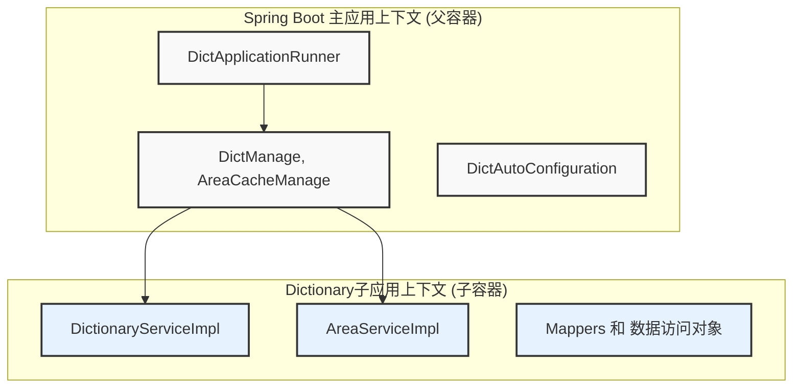
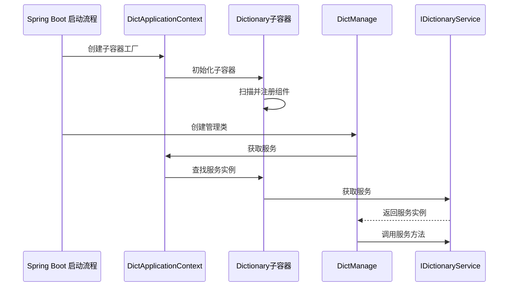
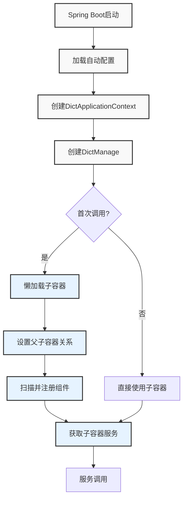
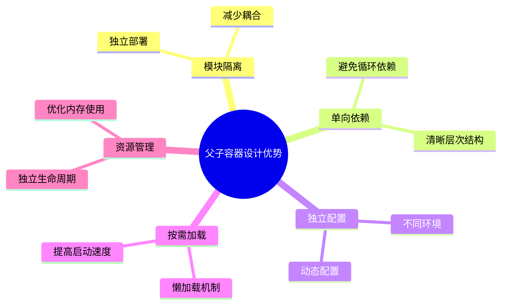
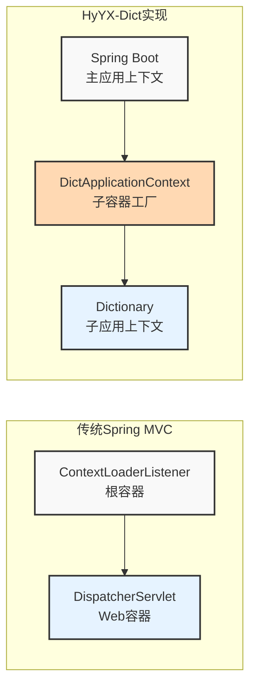

# 字典模块父子容器实现机制

## 概述

字典模块是一个字典服务模块，它采用了Spring的父子容器设计模式，通过自定义的容器工厂实现了一种特殊的上下文隔离机制。这种设计使得字典服务可以在独立的Spring容器中运行，同时又能与主应用程序上下文进行交互。

主要特点：
- 将字典服务相关组件隔离在独立容器中
- 维持严格的单向依赖（子容器可访问父容器，反之不行）
- 支持懒加载和独立生命周期管理
- 通过特定接口实现父子容器间的受控交互

## 架构设计

### 父子容器关系图



### 组件交互流程



## 工作流程



1. **启动流程**：
   - Spring Boot应用启动，通过`spring.factories`自动配置机制加载`DictAutoConfiguration`
   - 创建`DictApplicationContext`实例作为子容器工厂
   - 创建管理类`DictManage`和`AreaCacheManage`等

2. **容器初始化**：
   - 当`DictManage`首次调用`context.getInstance()`时，触发子容器懒加载
   - `DictContextFactory.getContext()`创建新的`AnnotationConfigApplicationContext`
   - 设置父子容器关系，注册配置类`DictApplication`
   - 扫描指定包路径(`com.yonghui.hyyx.cache.dict.context`)下的所有组件加入子容器

3. **服务调用**：
   - 管理类(如`DictManage`)通过`context.getInstance(IDictionaryService.class)`获取子容器中的服务
   - 子容器中的服务可以访问父容器中的Bean，但父容器不能直接访问子容器的Bean，保持单向依赖

4. **数据初始化**：
   - `DictApplicationRunner`作为应用启动后的处理器，调用`dictManage.loadAll()`加载字典数据

## 优势与应用场景



这种父子容器的设计具有以下优势：

1. **模块隔离**：将字典服务相关的组件隔离在独立容器中，减少与主应用的耦合
2. **单向依赖**：保持子容器对父容器的单向依赖，避免循环依赖问题
3. **独立配置**：子容器可以有自己的独立配置，不受主应用配置的干扰
4. **按需加载**：子容器可以实现懒加载，仅在需要时才创建和初始化
5. **资源管理**：子容器可以有独立的生命周期管理，便于资源释放

适用场景：

- 需要隔离的独立功能模块
- 有特殊生命周期管理的组件
- 需要动态创建和销毁的上下文
- 微服务架构中的服务发现和调用模式

## 与传统Spring MVC父子容器的区别



传统Spring MVC应用中，父子容器通常由：
- `ContextLoaderListener`创建的根容器(父容器)
- `DispatcherServlet`创建的Web容器(子容器)

而本项目使用了更灵活的定制容器创建方式，基于`AnnotationConfigApplicationContext`和自定义的工厂模式，实现了类似效果但更加灵活的父子容器机制。

## 详细实现机制

### 父子容器实现方式

**父子容器设计**：
- 这个项目使用了一个特殊的设计模式，通过`DictContextFactory`和`DictApplicationContext`创建了一个独立的Spring容器作为子容器
- 主容器是Spring Boot应用的主上下文，子容器是通过`DictApplicationContext`创建的专用上下文

**核心实现机制**：
- `DictContextFactory`类继承了`DisposableBean`和`ApplicationContextAware`接口，这使它能够获取父容器引用并在销毁时正确处理资源
- 在`createContext()`方法中，明确设置了父子关系：`context.setParent(this.parent)`

**子容器初始化**：
- 在`DictApplicationContext`类中，通过调用父类`DictContextFactory`的构造函数，指定了子容器的配置类是`DictApplication.class`
- `DictApplication`使用`@ComponentScan`注解扫描特定的包`com.yonghui.hyyx.cache.dict.context`，这意味着只有这个包下的组件才会被子容器管理

**自动配置与启动**：
- `spring.factories`文件通过Spring Boot的自动配置机制注册了`DictAutoConfiguration`和`DictApplicationRunner`
- `DictAutoConfiguration`负责创建子容器需要的bean
- `DictApplicationRunner`作为应用启动后的处理器，负责初始化字典数据

**父子容器交互**：
- 父容器创建了`DictManage`和`AreaCacheManage`等管理类
- 这些管理类持有子容器的引用(`DictApplicationContext`)，并通过它访问子容器中的服务：`dictionaryService=context.getInstance(IDictionaryService.class)`

**子容器范围**：
- 子容器主要负责管理字典数据相关的服务层和持久层组件
- 从注释可以看出："初始化字典上下文容器，如果有一些特殊的bean需要声明的可以声明在此处，注意声明的bean属于子容器的，父容器获取不到"

这是一个比较复杂和精巧的设计，通过自定义的`NamedContextFactory`模式实现了Spring MVC中父子容器的概念，而不是使用传统的`ContextLoaderListener`和`DispatcherServlet`方式。

## 核心组件说明

### 1. DictContextFactory

这是整个父子容器实现的核心类，它实现了以下功能：

- 实现`ApplicationContextAware`接口以获取父容器引用
- 实现`DisposableBean`接口以确保容器销毁时资源正确释放
- 提供创建子容器的核心方法`createContext()`
- 设置父子容器关系`context.setParent(this.parent)`

```java
public class DictContextFactory implements DisposableBean, ApplicationContextAware {
    // ...
    
    protected AnnotationConfigApplicationContext createContext() {
        AnnotationConfigApplicationContext context = new AnnotationConfigApplicationContext();
        context.register(PropertyPlaceholderAutoConfiguration.class,
            this.defaultConfigType);
        
        // 设置属性源
        context.getEnvironment().getPropertySources().addFirst(new MapPropertySource(
            this.propertySourceName,
            Collections.<String, Object>singletonMap(this.propertyName, this.contextName)));
        
        // 设置父子容器关系
        if (this.parent != null) {
            context.setParent(this.parent);
            context.setClassLoader(this.parent.getClassLoader());
        }
        
        context.setDisplayName(generateDisplayName(this.contextName));
        context.refresh();
        return context;
    }
    
    // 从子容器获取Bean实例
    public <T> T getInstance(Class<T> type) {
        AnnotationConfigApplicationContext context = getContext();
        if (BeanFactoryUtils.beanNamesForTypeIncludingAncestors(context,
            type).length > 0) {
            return context.getBean(type);
        }
        return null;
    }
}
```

### 2. DictApplicationContext

继承自`DictContextFactory`，指定了子容器配置类和命名信息：

```java
public class DictApplicationContext extends DictContextFactory {
    public DictApplicationContext() {
        super(DictApplication.class, "Dict", "dict.client.name");
    }
}
```

### 3. DictApplication

子容器的配置类，通过`@ComponentScan`注解指定哪些包下的组件会被子容器所管理：

```java
@Configuration
@ComponentScan({"com.yonghui.hyyx.cache.dict.context"})
public class DictApplication {
    // 初始化字典上下文容器，如果有一些特殊的bean需要声明的可以声明在此处
    // 注意声明的bean属于子容器的，父容器获取不到
}
```

### 4. DictAutoConfiguration

通过Spring Boot自动配置机制，注册必要的Bean到父容器中：

```java
@Configuration
public class DictAutoConfiguration {
    @Bean
    DictApplicationContext dictApplicationContext(){
        return new DictApplicationContext();
    }
    
    @Bean
    DictManage dictManage(DictApplicationContext dictApplicationContext){
        return new DictManage(dictApplicationContext);
    }
    
    // 更多Bean定义...
}
```

### 5. DictManage

父容器中的管理类，持有子容器引用并使用子容器中的服务：

```java
public class DictManage {
    // ...
    DictApplicationContext context;
    IDictionaryService dictionaryService;
    
    public DictManage(DictApplicationContext context){
        this.context=context;
        dictionaryService=context.getInstance(IDictionaryService.class);
    }
    
    // 字典管理方法...
}
``` 