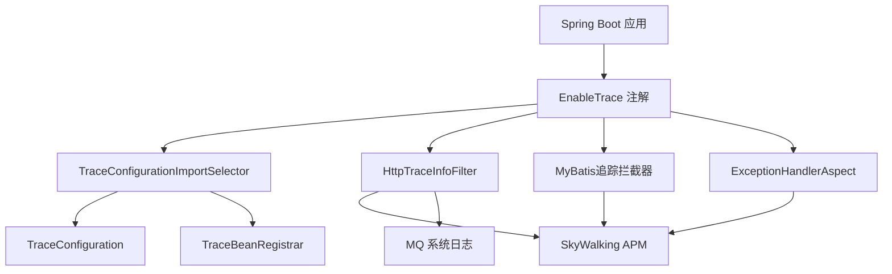

# trace 文档

## 概述

trace 是一个分布式追踪模块，旨在为 Spring Boot 应用程序提供应用级追踪功能。它利用 SkyWalking 进行分布式追踪，并为各种应用组件（如 HTTP 请求和 MyBatis 数据库操作）提供拦截器。

## 架构



## 核心组件

### 1. 启用和配置

- **EnableTrace 注解**：在 Spring Boot 应用中启用追踪的入口点
  - 配置包含/排除的 URL 模式
  - 导入必要的配置和拦截器
  
- **TraceProperties**：追踪模块的配置属性
  - 控制是否启用追踪
  - 配置 SkyWalking URL
  - 定义要排除追踪的 URL 模式

### 2. HTTP 追踪

HTTP 追踪由几个组件处理：

- **HttpTraceInfoFilter**：拦截 HTTP 请求和响应的 Servlet 过滤器
  - 捕获 HTTP 方法、URI、头信息、请求参数和响应内容
  - 在 SkyWalking spans 中标记这些信息
  - 将系统日志发送到消息队列进行进一步处理

- **CustomHttpServletRequestWrapper 和 CustomHttpServletResponseWrapper**：
  - 包装类，允许多次读取请求和响应

- **TraceHeaderInterceptor**：
  - 处理分布式追踪中跨服务的追踪头信息

### 3. 数据库追踪

MyBatis 操作通过专门的拦截器进行追踪：

- **MybatisTraceInterceptor**：MyBatis 操作的基础拦截器
  - 捕获 SQL 语句和查询 ID
  - 在 SkyWalking spans 中标记这些信息

- **MybatisTraceSelectInterceptor**：专门用于 SELECT 操作
- **MybatisTraceUpdateInterceptor**：专门用于 UPDATE 操作
- **SqlTraceUtil**：用于格式化带参数的 SQL 查询的工具类

### 4. 异常处理

- **ExceptionHandlerAspect**：拦截异常处理器
  - 捕获异常并在 SkyWalking spans 中标记
  - 确保错误在分布式追踪系统中被正确记录

## 数据流程

1. **HTTP 请求追踪**：
   - HTTP 请求到达应用
   - `HttpTraceInfoFilter` 拦截请求
   - 捕获请求详情并在 SkyWalking 中标记
   - 请求继续到适当的处理器
   - 捕获响应并在 SkyWalking 中标记
   - 系统日志发送到消息队列

2. **数据库操作追踪**：
   - 适当的拦截器拦截 MyBatis 操作
   - 捕获 SQL 语句、查询 ID 和操作类型
   - 在 SkyWalking spans 中标记信息
   - 数据库操作正常进行

3. **异常追踪**：
   - 当异常发生并由异常处理器处理时
   - `ExceptionHandlerAspect` 拦截异常处理
   - 在 SkyWalking spans 中标记异常以进行错误跟踪

## 与 SkyWalking 集成

该模块使用 SkyWalking Java 代理进行分布式追踪：

- `apm-toolkit-trace` 依赖提供：
  - `ActiveSpan.tag()` 用于自定义 span 标签
  - `ActiveSpan.error()` 用于标记 span 错误
  
- 模块通过 `skyWalkingUrl` 属性配置连接到 SkyWalking 后端

## 使用方法

要在 Spring Boot 应用中启用追踪：

1. 将 trace 依赖添加到项目中
2. 在应用配置类上添加 `@EnableTrace` 注解
3. 在 application.properties/yml 文件中配置追踪属性：

```properties
trace.enable=true
trace.skywalkingUrl=http://your-skywalking-server:port
trace.excludePatterns=/**/*.js,/**/*.css,/**/*.html
```

## 优势

1. **端到端追踪**：从 HTTP 入口点追踪请求，直到数据库操作
2. **全面上下文**：捕获方法参数、SQL 语句和响应数据
3. **性能监控**：识别慢操作和性能瓶颈
4. **错误追踪**：在分布式追踪中自动标记异常
5. **系统日志**：记录详细的系统日志用于审计和调试

## 结论

hyyx-trace 模块为 Spring Boot 应用提供了全面的分布式追踪解决方案。通过利用 SkyWalking 并拦截关键应用组件，它提供了对应用行为、性能和错误的详细洞察，这对于微服务架构中的故障排除和监控至关重要。 