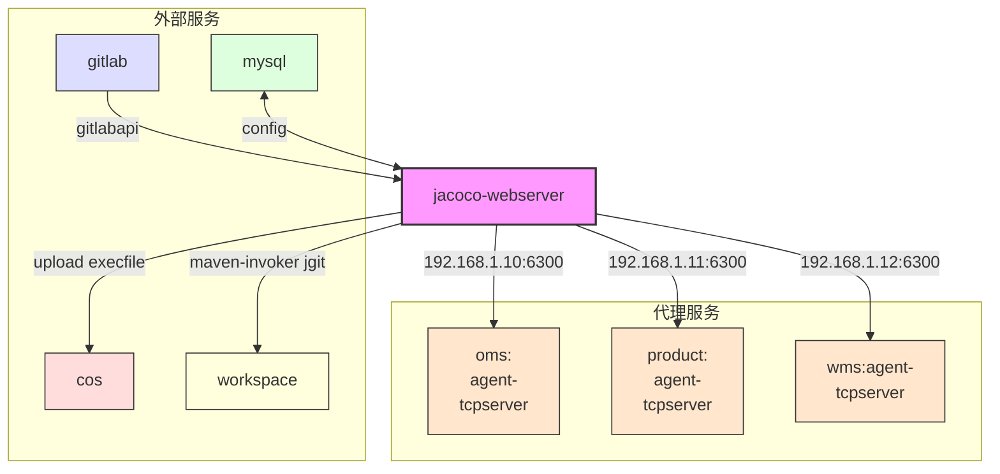
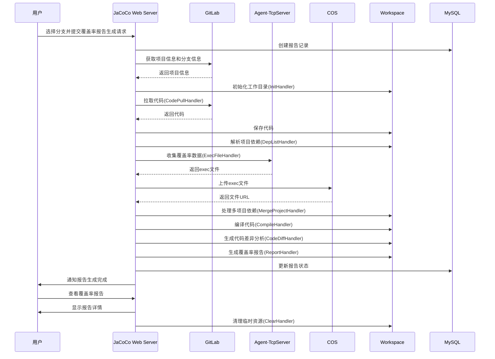

# JaCoCo Web Server 项目架构文档

## 项目概述

JaCoCo Web Server是一个基于Spring Boot的Java应用程序，用于管理和生成JaCoCo代码覆盖率报告。它提供了一个Web界面，允许用户管理项目、上传exec文件、生成报告以及查看代码覆盖率详情。该项目通过整合GitLab、Maven、JaCoCo等工具，实现了代码覆盖率分析的自动化流程。

## 技术栈

- **框架**: Spring Boot 2.1.3
- **ORM**: MyBatis-Plus 3.5.3
- **数据库**: MySQL
- **API文档**: Swagger 2.9.2
- **工具库**: 
  - Hutool 5.8.2 (通用工具库)
  - GitLab4J 5.2.0 (GitLab API集成)
  - JGit 5.13.1 (Git操作)
  - JaCoCo 0.8.7 (代码覆盖率工具)
  - JavaParser 3.25.3 (Java源码解析)
  - Maven Invoker 3.2.0 (Maven命令执行)
- **存储服务**: 腾讯云COS

## 系统架构

### 组件交互图



### 流程泳道图



## 项目结构

```
jacoco-webserver/
├── src/
│   ├── main/
│   │   ├── java/
│   │   │   └── com/qimo/jacoco/
│   │   │       ├── comment/            # 通用响应类
│   │   │       ├── config/             # 配置类
│   │   │       ├── controller/         # 控制器层
│   │   │       ├── dto/                # 数据传输对象
│   │   │       ├── entity/             # 实体类
│   │   │       ├── executor/           # 执行器
│   │   │       ├── handler/            # 责任链处理器
│   │   │       ├── manage/             # 管理层
│   │   │       ├── mapper/             # MyBatis映射器
│   │   │       ├── service/            # 服务层
│   │   │       ├── util/               # 工具类
│   │   │       ├── websocket/          # WebSocket实现
│   │   │       └── JacocoWebserverApplication.java  # 应用入口
│   │   └── resources/
│   │       ├── application.properties  # 应用配置
│   │       ├── logback-spring.xml      # 日志配置
│   │       ├── sql/                    # SQL文件目录
│   │       └── static/                 # 静态资源
├── lib/                                # 本地依赖库
└── pom.xml                             # Maven配置
```

## 核心功能模块

### 1. 项目管理模块

- 提供项目列表查询、添加功能
- 与GitLab集成，自动获取项目信息

### 2. 报告生成模块

- 基于分支生成覆盖率报告
- 支持多项目汇总
- 通过责任链模式实现报告生成流程的可扩展性

### 3. 文件管理模块

- 管理Exec文件的上传、下载和查询
- 与腾讯云COS集成实现文件存储

### 4. 报告详情模块

- 展示代码覆盖率详情数据
- 支持按项目、文件、类等维度查看覆盖率信息

## 数据模型

主要实体模型包括：

1. **Project**: 项目信息，包含项目ID、名称、GitLab地址等
2. **Report**: 报告信息，包含分支名称、项目列表、状态等
3. **ReportDetail**: 报告详情，包含覆盖率数据
4. **ExecFile**: Exec文件信息，包含文件路径、上传时间等
5. **Branch**: 分支信息
6. **Version**: 版本信息，包含项目、分支、地址等

## 工作流程

报告生成的责任链处理流程如下：

1. **初始化环境** (InitHandler): 创建工作目录
2. **拉取代码** (CodePullHandler): 从GitLab拉取代码
3. **获取依赖列表** (DepListHandler): 解析项目依赖
4. **处理Exec文件** (ExecFileHandler): 收集并合并Exec文件
5. **合并项目** (MergeProjectHandler): 处理多项目间的依赖关系
6. **编译代码** (CompileHandler): 使用Maven编译项目
7. **代码对比** (CodeDiffHandler): 生成代码差异分析
8. **报告生成** (ReportHandler): 使用JaCoCo生成HTML报告
9. **清理资源** (ClearHandler): 清理临时文件和资源

## 系统配置

系统主要配置项包括：

- 数据库连接配置
- 腾讯云COS存储配置
- Maven配置
- GitLab集成配置
- JaCoCo报告路径配置

## 扩展性设计

1. **责任链模式**: 通过责任链模式实现报告生成流程的可扩展性
2. **MyBatis-Plus**: 使用MyBatis-Plus简化数据访问层
3. **WebSocket**: 支持实时进度通知
4. **文件存储**: 通过抽象接口支持多种存储方式

## 总结

JaCoCo Web Server是一个功能完整的代码覆盖率管理系统，它通过整合多种工具和技术，提供了一个自动化的代码覆盖率分析平台。系统采用了责任链模式设计报告生成流程，使其具有良好的可扩展性和可维护性。 