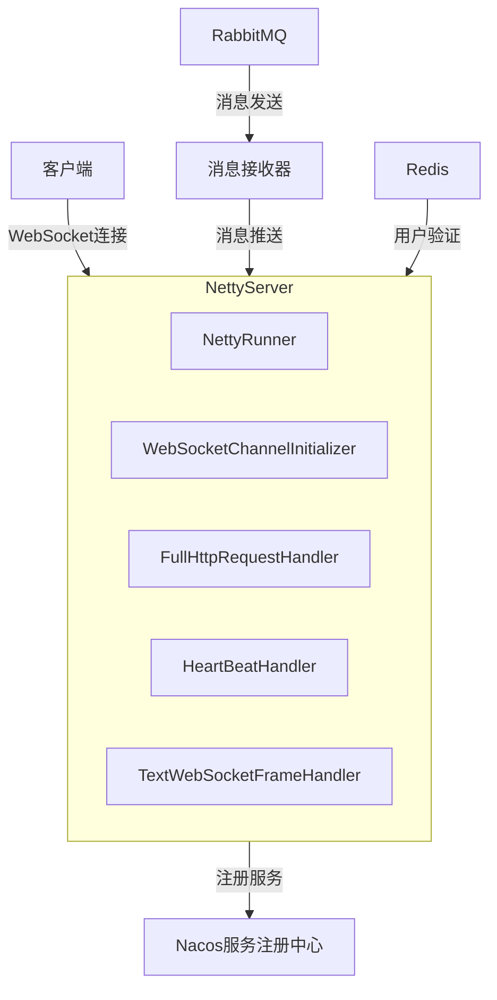
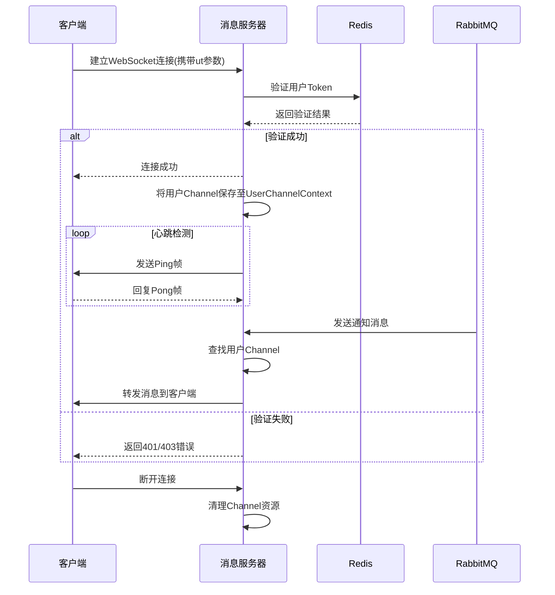

# 消息服务器

## 概述

消息服务器是一个基于 Netty 和 Spring Boot 构建的 WebSocket 实时消息系统。它为向连接的客户端发送实时通知提供了强大的基础。该服务器使用 Nacos 进行服务注册，使用 RabbitMQ 进行消息处理。

## 架构

系统遵循客户端-服务器架构，其中：
- 客户端通过 WebSocket 协议连接
- 通过令牌验证进行身份验证
- 消息通过 RabbitMQ 分发
- 服务发现由 Nacos 处理



### 消息流程图



## 核心组件

### 服务器初始化

- **NettyRunner**: Netty服务器的入口点。它初始化服务器引导程序，配置通道处理程序，并管理服务器的生命周期。服务器默认在端口9090上运行（可配置）。

- **WebSocketChannelInitializer**: 为每个新连接配置处理程序管道，包括HTTP编解码器、WebSocket协议处理、身份验证和消息处理。

### 连接管理

- **FullHttpRequestHandler**: 处理初始HTTP连接请求，通过令牌认证用户，并管理连接建立。它通过请求URL中的"ut"参数验证Redis中的用户会话。

- **UserChannelContext**: 维护用户和其活动WebSocket通道之间的映射。它强制执行连接限制（每个用户最多3个连接）并提供管理通道关联的方法。

### 消息处理

- **TextWebSocketFrameHandler**: 处理来自客户端的文本消息，并管理通道生命周期事件，如断开连接。

- **HeartBeatHandler**: 管理连接空闲状态，并发送ping帧以确保连接保持活动状态。

- **NoticeReceiver**: 监听RabbitMQ队列的通知，并将其转发给适当的用户通道。

### 服务注册

- **NacosServiceRegister**: 将WebSocket服务注册到Nacos以进行服务发现，并在应用程序关闭时注销服务。

### 数据模型

- **ChannelMessage**: 服务器和客户端之间数据交换的通用消息容器。

- **Notice**: 表示可以发送给用户的通知，支持各种内容类型。

## 配置

- 默认服务名称: "hy-notice"
- 默认端口: 9090
- WebSocket路径: "/{SERVICE_NAME}/ws"

## 认证流程

1. 客户端连接时URL中包含"ut"（用户令牌）参数
2. 服务器对照Redis验证令牌
3. 如果有效，用户通过身份验证并建立连接
4. 如果无效，连接会被拒绝，并返回适当的HTTP状态码

## 消息流程

1. 消息发布到RabbitMQ的扇出交换器
2. NoticeReceiver从交换器消费消息
3. 对于每条消息，接收器查找适当的用户通道
4. 如果用户在线，消息将转发到其所有活动通道
5. 如果用户离线，消息将被丢弃

## 连接生命周期

1. 客户端使用身份验证令牌发起WebSocket连接
2. 服务器对客户端进行身份验证
3. 通过ping-pong心跳维护连接
4. 当客户端断开连接或连接超时时，资源被清理

## Netty端口暴露与服务注册

### Netty端口配置与Nacos注册

系统通过`NacosServiceRegister`类将Netty服务器的端口注册到Nacos服务注册中心，使其他服务能够发现并连接到WebSocket服务。以下是具体实现方式：

1. 端口配置：
   ```yaml
   # 在application.yml或bootstrap.yml中配置
   netty:
     server:
       port: 9090  # 默认为9090，可自定义
   ```

2. 服务注册：
   `NacosServiceRegister`类实现了`ApplicationContextAware`和`InitializingBean`接口，在Spring容器初始化后自动准备服务注册信息：
   
   ```java
   @Component
   public class NacosServiceRegister implements ApplicationContextAware, InitializingBean {
       // 注入配置的Netty端口
       @Value("${netty.server.port:9090}")
       private int port;
       
       @Autowired
       private NacosServiceRegistry registry;
       
       @Autowired
       NacosDiscoveryProperties properties;
       
       @Override
       public void afterPropertiesSet() throws Exception {
           // 创建新的属性对象，避免修改全局配置
           NacosDiscoveryProperties nacosDiscoveryProperties = new NacosDiscoveryProperties();
           BeanUtils.copyProperties(properties, nacosDiscoveryProperties);
           // 设置服务名称和端口号
           nacosDiscoveryProperties.setService(ServerConst.SERVICE_NAME);
           nacosDiscoveryProperties.setPort(this.port);
           // 创建注册对象
           this.nacosRegistration = new NacosRegistration(null, nacosDiscoveryProperties, context);
       }
       
       // 服务注册方法，在NettyRunner中启动Netty服务器后调用
       public void register() {
           this.registry.register(this.nacosRegistration);
       }
       
       // 服务注销方法，在应用关闭时调用
       public void deregister() {
           this.registry.deregister(this.nacosRegistration);
       }
   }
   ```

3. 注册流程：
   - Netty服务器在`NettyRunner`类中启动
   - 启动成功后调用`nacosServiceRegister.register()`进行服务注册
   - 注册信息包含服务名称(`hy-notice`)和端口号
   - 其他微服务可通过Nacos发现该WebSocket服务

4. 客户端连接：
   其他服务通过Nacos服务发现获取WebSocket服务的地址和端口，然后可以构建连接URL：
   ```
   ws://{host}:{port}/{SERVICE_NAME}/ws?ut={userToken}
   ```

5. 优势：
   - 服务自动注册，无需手动配置
   - 支持多实例部署，实现负载均衡
   - 当服务实例地址变更时，客户端可通过Nacos自动获取最新地址
   - 服务健康检查，自动剔除不健康的实例

### 自定义注册元数据

如需向Nacos注册更多服务信息，可以在`NacosServiceRegister`中添加自定义元数据：

```java
@Override
public void afterPropertiesSet() throws Exception {
    NacosDiscoveryProperties nacosDiscoveryProperties = new NacosDiscoveryProperties();
    BeanUtils.copyProperties(properties, nacosDiscoveryProperties);
    nacosDiscoveryProperties.setService(ServerConst.SERVICE_NAME);
    nacosDiscoveryProperties.setPort(this.port);
    
    // 添加自定义元数据
    Map<String, String> metadata = new HashMap<>();
    metadata.put("protocol", "websocket");
    metadata.put("websocket-path", "/" + ServerConst.SERVICE_NAME + "/ws");
    nacosDiscoveryProperties.setMetadata(metadata);
    
    NacosRegistration nacosRegistration = new NacosRegistration(null, nacosDiscoveryProperties, context);
    this.nacosRegistration = nacosRegistration;
}
```

## 开发者注意事项

- 系统每个用户令牌最多支持3个连接
- 心跳配置为5秒的写入空闲超时
- 服务器向Nacos注册自己以进行服务发现
- 维护通道上下文以向特定用户广播消息
- WebSocket路径遵循"/{SERVICE_NAME}/ws"模式

## 依赖

- Netty: 网络应用框架
- Spring Boot: 应用框架
- RabbitMQ: 消息代理
- Nacos: 服务发现
- Redis: 会话和令牌存储 